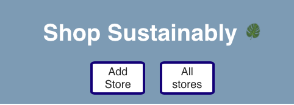
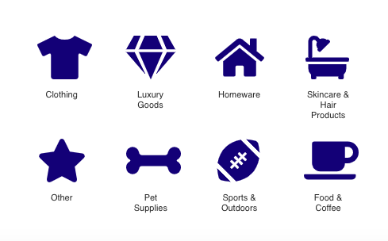

# Shop Sustainably

### [Link to Web App](https://sustainability.tessgronski.now.sh/)

_This project was bootstrapped with [Create React App](https://github.com/facebook/create-react-app)._
 

 
Shop Sustainably is a collection of retail stores that sell sustainable products or offer sustainable alternatives. Users looking for new sustainable stores to check out, can either shop all stores or navigate Shop Sustainably by category of interest:

Users can also add new stores that they want to share with others by selecting Add Store.
 
 

### Front End Technologies Used:

#### -HTML/CSS

#### -Javascript

#### -React
